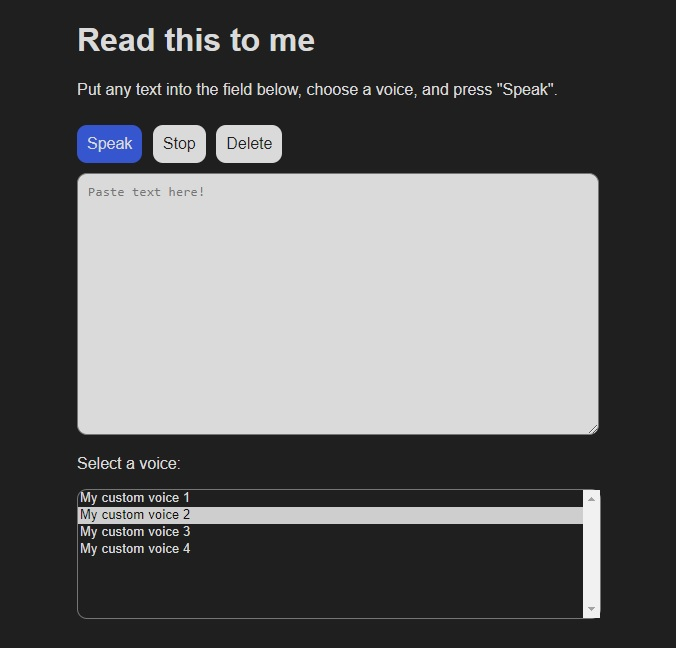

# Basic Text-to-speech Tool

The goal of this project was to create a basic HTML text-to-speech tool. It uses the [Web Speech API](https://developer.mozilla.org/en-US/docs/Web/API/SpeechSynthesisUtterance) to read the supplied text and adheres to the following **design philosophy**:

- Self-contained HTML file (with CSS and JS inside)
- Keep it *simple* yet aesthetically pleasing
- Offline if possible



Currently, only Czech and English text-to-speech modules are displayed. This can be changed in the JavaScript portion of the HTML file by searching for `cs-CZ` or `en-US` (in the `myLanguages()` function) and changing these to other languages.

## How To

1. Download or copy the contents of `index.html`
2. (Optional: Change the default languages – see above)
3. Open `index.html` in your browser

Note that depending on your system and browser of choice, different text-to-speech modules may be loaded. Some of these modules may require an internet connection.

## References

This project was inspired or based on the following sources:

```
https://developer.mozilla.org/en-US/docs/Web/API/SpeechSynthesisUtterance
- Code snippets for the TTS implementation

https://stackoverflow.com/a/63867769
- Note about autoplay policies

https://github.com/zolomohan/text-to-speech
- Original inspiration for the project

https://www.assemblyai.com/blog/javascript-text-to-speech-easy-way/
- Another inspiration for the project
```
